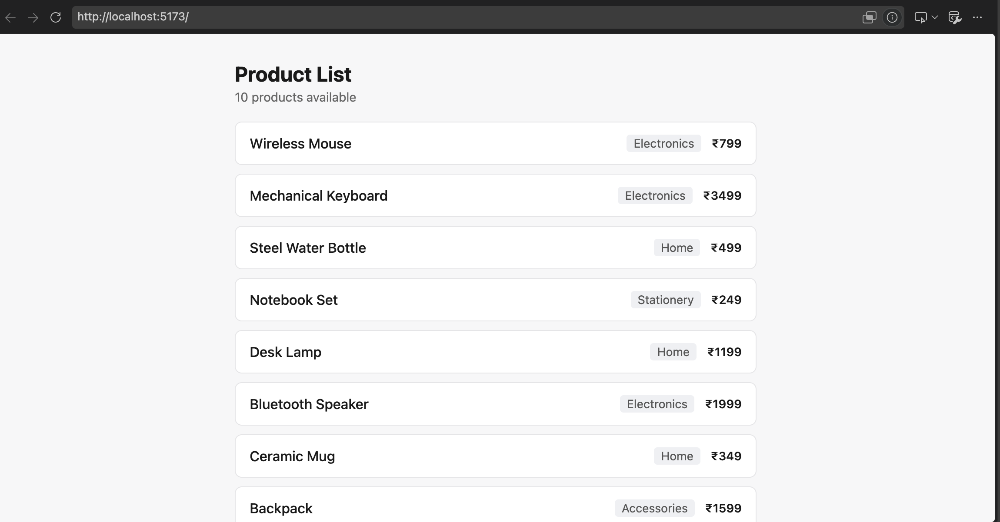

# From Vibecoder to Real Builder

## Prerequisite
softwares required
- nodejs
- npm
- git
- opencode

### local setup
- `git clone https://github.com/biswajit-713/iter-vibe-coding-1.git`
- open the directory in visual studio code and launch terminal
- run `git switch vibe-run` to switch to the branch
- run `npm install` - it installs the dependencies from package.json
- run `npm run dev` - the application is running on http://localhost:5173
- open another terminal and run `opencode` - it launches opencode
- run `/model` and choose a model (preferably **Big Pickle**)

If your app is run fine, you should see the following in http://localhost:5173



## time to vibe code
Make sure opencode is in `build` mode. If not, switch to it by pressing tab.
run the prompt - `Add a way to search or filter the product list`
![]

### why vibe coding is limiting

## let's plan it
switch to plan mode
prompt - 
screenshot of output

### what is the limitation

### give an explicit command to save it
### what is the limitation

## let's make our agent intelligent
/init
what should the agents.md contain.
screenshot and pruning

#### why this is not enough

## create a planning command
```
difference between command, skill and subagent
```

## create an implementation command

## create a review skill
### skill an subagent

## why hooks

## how does real world do this