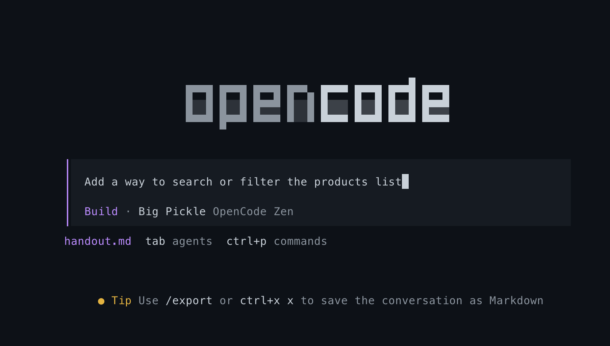
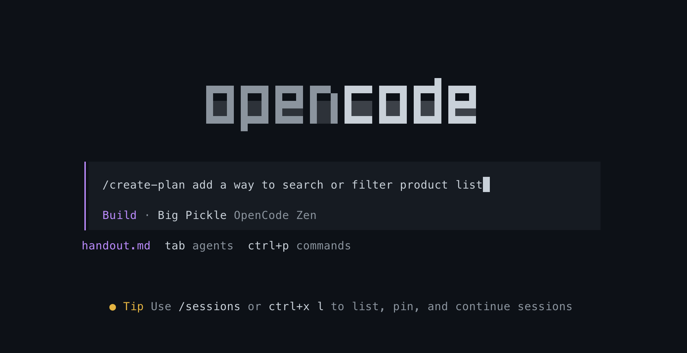

# From Vibecoder to Real Builder

In this session we start by vibe coding a feature, watch it fall apart as an engineering practice, and then rebuild the same feature through a real workflow — a plan, a command, an implementation, a review, and a guardrail.

Work along on your own machine. Every section has something for you to run.

## Prerequisite

Software required

- nodejs
- npm
- git
- opencode

You also need opencode to be signed in and able to reach a model. Run `opencode auth login` if you have credits available. Otherwise stick to a free model, preferably `Big Pickle`.

### Local setup

- `git clone https://github.com/biswajit-713/iter-vibe-coding-1.git`
- open the directory in visual studio code and launch terminal
- run `git switch vibe-run` to switch to the branch
- run `npm install` - it installs the dependencies from package.json
- run `npm run dev` - the application is running on http://localhost:5173
- open another terminal and run `opencode` - it launches opencode
- run `/model` and choose a model (preferably **Big Pickle**)

If your app is running fine, you should see the following in http://localhost:5173


Keep both terminals open for the whole session. One runs the app, the other runs opencode.

## Time to vibe code

opencode has two modes — `build` and `plan`. The `tab` key toggles between them, and the current mode is shown at the bottom of the opencode screen.

Make sure opencode is in `build` mode. If not, switch to it by pressing `tab`.

Run the prompt - `Add a way to search or filter the product list`



After successful implementation, you will see a filter created in the app running on http://localhost:5173.
Depending on what the model chose to build (as LLMs are non-deterministic), you will see some variance of a search and filter option.

### Why vibe coding is limiting

There are two particular reasons:

1. The model didn't explain why it chose to build what it built. If we don't know, how do we explain the rationale to others?
2. The model may build something else next time we give the same prompt. We need predictability in action. **Engineering is all about ensuring consistency in result when the process is same.**

## Let's plan it

Reset your working directory first, so we start the same feature from a clean slate:

- run `git restore .` to discard the changes
- run `git clean -fd .` to remove any new files the model created
- run `git status` and confirm it reports a clean tree

Switch to plan mode (press `tab`) and put the same prompt - `Add a way to search or filter the product list`

Now the model explains its plan and asks for our approval. The model has turned from an eager executor into an eager planner.

### Why it's not enough

While the model now explains what it intends to do, the plan is still on the terminal. If we close the session, we have nothing saved. We will have to re-prompt. Also, how do you share it with your teammate?

You can certainly prompt again asking to save the plan in a `plans/search-and-filter.md` file. But you don't want to do it every time you create a plan. `Saving the plan` is a repeated instruction that opencode can take care of for us, if we introduce a rule.

## Time to make our agent intelligent

Let's digress a bit and build some intelligence into the model. Every coding agent offers a provision to document useful information that goes into the system prompt to the LLM every time we prompt something. For opencode it is stored in `AGENTS.md`. Claude Code stores it in `CLAUDE.md`. We can write an instruction in AGENTS.md asking opencode to save the plan in a particular location every time we generate a plan.

Let's do it.

- run `/init` in opencode. The LLM makes its best guess and creates an `AGENTS.md`

If you read through it, it may sound like useful information. However, some of it is redundant — opencode can find it by reading `package.json`. Repeating the same information is redundant at best, and at worst it crowds the context and invites the model to hallucinate. So strip AGENTS.md down to its minimum.

- Here is what you may see created through `/init`

```markdown
# AGENTS.md

Workshop starter for the **Industry Gurukul: Using AI Coding Assistants** masterclass (ITER batch 1).
Deliberately tiny: React 18 + Vite 5 that renders a hardcoded list of 10 products and nothing else.
The session builds a search/filter feature on top of it live. Do not over-engineer — keep changes
dependency-free, no backend/router/state library (see the comment in `src/data/products.js`).

## Commands
- `npm run dev` — Vite dev server at http://localhost:5173
- `npm test` — Vitest, non-watch (`vitest run`). Currently exits 1 with "No test files found" — that is expected until tests exist.
- `npm run build` / `npm run preview` — production build / preview.
- No linter or formatter is configured. Do not add one unless asked.

## Architecture
- `src/data/products.js` — the only data source: 10 hardcoded products (`id`, `name`, `category`, `price`). Prices are ₹ (INR).
- `src/components/ProductList.jsx` — renders items; price is displayed as `₹{product.price}`.
- `src/App.jsx` — header (counts products) + `<ProductList />`; `src/main.jsx` mounts it.
- Styling: one global stylesheet `src/index.css` with flat lower-dash classes (`.product-list`, `.product-card`, …). Extend it; no CSS modules, Tailwind, or component libs.

## Testing
- Vitest + jsdom + `globals: true` are configured in `vite.config.js`, and `@testing-library/react` / `@testing-library/jest-dom` are installed — but there are **no test files yet**. Add them when you add behavior.
- jest-dom is **not** set up globally: import `@testing-library/jest-dom` in any test file that uses its matchers.
- No path aliases are configured (vite.config.js has none) — use relative `./` imports.
```

- Let's keep what is useful and not redundant

```markdown
# AGENTS.md

React + Vite, JSX only — no TypeScript. Stack and test config: package.json, vite.config.js.

- No lint, typecheck, or formatter configured. Don't look for one, don't invent one.
- Vitest + Testing Library are installed but no test files exist yet. Run all: `npm run test`. Run one: `npx vitest run <path>`.
- src/data/products.js is a hardcoded array on purpose. No backend, no API — don't add data-fetching or state libraries.
- Prices are INR (₹).
```

The AGENTS.md should contain only:

- project trivia
- information the agent can't discover, or would guess wrong

Now add the planning instruction we talked about. Append this to your AGENTS.md:

```markdown
## Planning

When I ask you to plan a feature, always save the plan as a markdown file under
`plans/` with a descriptive name, e.g. `plans/search-and-filter.md`.
Never start implementing until I have approved the plan.
```

Try plan mode again with the same prompt. This time the plan lands in a file, and you never had to ask for it.

### Why this is not enough

Our coding agent is now smart enough to save the plan file without us repeating ourselves. But remember the premise: **everything in AGENTS.md is sent to the LLM on every single prompt.** So even when we prompt to execute, to review, or just to brainstorm, that planning instruction is still shipped along, bloating the context window. A core tenet of harness engineering is keeping the context window minimal yet relevant.

We need a way to keep the instruction available without paying for it on every prompt. That is what commands, skills and subagents are for.

## Command, skill and subagent — what's the difference?

Before we build anything, get these three straight. They all hold instructions for the model. They differ in **who triggers them** and **what they cost you in context**.

**A command is a button you press.** You type `/create-plan` and a fixed set of instructions runs, in a fixed order, every time. A human decides when it runs. Because only a human triggers it, the steps are identical on every invocation — that is exactly what makes it a team standard. It costs nothing in context until you actually run it.

**A skill is a manual on the shelf that the model can reach for.** You don't invoke it; the model recognizes the situation and loads it. Only the skill's name and one-line description sit in context all the time — the full instructions are pulled in only once the model decides it is relevant. Use a skill when you cannot predict the exact moment the capability will be needed.

**A subagent is an intern you send off with a job.** It gets its own fresh context window, does the work, and hands back only its report. The raw material — every file it read, every command it ran — stays in its window and never reaches the main conversation. Use a subagent when the work is bulky, or when several jobs can run at the same time.

| | Who triggers it | Where it lives | What it costs in context |
|---|---|---|---|
| `AGENTS.md` | nobody — always on | `AGENTS.md` | the whole file, on every prompt |
| Command | you, by typing `/name` | `.opencode/command/name.md` | nothing until you run it |
| Skill | the model, when it fits | `.opencode/skills/name/SKILL.md` | name + description always; the body only when loaded |
| Subagent | the primary agent | `.opencode/agent/name.md` | its own window; only the report comes back |

Rule of thumb for this workshop: if a human must decide when it runs, make it a **command**. If the model should notice and reach for it, make it a **skill**. If it is heavy reading that would pollute the main conversation, push it into a **subagent**.

## Time to create our first command

Let's create a planning command. You can read the finished command [here](https://github.com/biswajit-713/iter-vibe-coding-1/blob/agent-superpower/.opencode/command/create-plan.md). However, I encourage you to ask opencode to create it. Read the instructions at the link and then ask opencode in your own words. Here is what I used:

```
Create a planning command. Name it `create-plan`. It should be invocable using `/create-plan`.
When the command is invoked, it should
- create a comprehensive implementation plan
- list which files will be created and which files will be modified
- save the plan to the plans directory with a descriptive name, e.g. plans/<feature-slug>.md
- not execute the plan until approved. each implementation requires a review and approval by the user
- not modify any other files in the project directory while writing the plan
```

Restart opencode after the command is created. You should now see the file at `.opencode/command/create-plan.md`.

Trigger the command - `/create-plan add a way to search or filter the product list`



You do not need to switch modes first. The command declares `agent: plan` in its frontmatter, so it puts itself into plan mode. The `agent-superpower` branch also ships an `opencode.json` that lets plan mode write to `plans/*.md` and nothing else — the guardrail is in configuration, not in a request to the model.

The plan will be saved in the `plans/` directory. Note the exact filename; you need it in the next step.

Now that the command exists, **delete the `## Planning` section you added to AGENTS.md**. That instruction was costing you context on every prompt, and `/create-plan` now does the same job for free. Replace it with a one-line index so the model knows the command exists:

```markdown
# Workflow Commands

- `/create-plan <description>` — Create a detailed implementation plan. Save to `plans/<slug>.md`. Present for review before any implementation.
```

That swap — a whole instruction traded for a single line — is the point of this section. You can copy the finished version from [agent-superpower](https://github.com/biswajit-713/iter-vibe-coding-1/blob/agent-superpower/AGENTS.md).

## Implementation time

Let's create an implementation command, just like the planner. Refer to the [implement command](https://github.com/biswajit-713/iter-vibe-coding-1/blob/agent-superpower/.opencode/command/implement.md), or if you are brave enough, ask opencode to create this new command for you.

A moment to pause and reflect on why this is a command and not a skill. A command introduces a standard within the team. It is only invoked by a human, so the same steps run every time. Read through `/create-plan` and `/implement` [here](https://github.com/biswajit-713/iter-vibe-coding-1/tree/agent-superpower/.opencode/command) and you will see the consistency in pattern. These instructions must always execute, and in that particular order, to keep our software development workflow consistent.

Restart opencode, then trigger the implementation with the plan's slug:

`/implement <plan-slug>`

e.g. `/implement search-and-filter-products`

Pass the slug, not the path. The command already looks inside `plans/`, so `/implement plans/search-and-filter-products.md` would send it hunting for `plans/plans/...`.

Two things will surprise you if you are not expecting them:

- **It cuts a new branch.** `/implement` creates `feat/<slug>` off your current branch, so you will no longer be on `vibe-run` after this step. Run `git branch` to see where you landed.
- **It works test-first.** The command enforces strict TDD — one failing test, then the minimal code to pass it, then the next test. It will not commit unless `npm run test` is fully green. This is slower to watch than vibe coding, and that is the whole point.

## Review time

Once the code is implemented, you want the LLM to review the changes before you, the human owner, review the code. A review is always multi-dimensional:

- review that the changes match the specification in the plan file
- review that no secrets are leaked
- review that the code is clean and consistent
- review that the code is not verbose — just enough, and simple enough to explain the intent

We build this as a skill instead of a command (a command would also be appropriate). We want the review to kick off automatically when implementation finishes, and a skill is discoverable by the model — so a skill it is. The skill spawns four subagents, one per axis. Each subagent gets its own context window and returns only its finding, so four full code reviews never land in the primary conversation.

The skill and subagents are on the `agent-superpower` branch:

- [skill](https://github.com/biswajit-713/iter-vibe-coding-1/tree/agent-superpower/.opencode/skills/) — `post-commit-review`
- [subagents](https://github.com/biswajit-713/iter-vibe-coding-1/tree/agent-superpower/.opencode/agent) — `review-correctness`, `review-secrets`, `review-standards`, `review-verbosity`

Or, if you are a curious soul, ask opencode to create the skill and the subagents. Keep probing until it builds them the way they are in the repo. Ask it hard questions about why it chose to do something in a particular way.

Restart opencode after creating them, the same as you did for the commands.

You should not need to invoke this yourself — `/implement` loads the skill after its commit succeeds. If you want to run it on its own, just ask in plain language: *review the last commit*. The model matches your request against the skill's description and loads it.

The output arrives as four separate sections — Correctness, Secrets, Standards, Verbosity — each with its own findings. They are deliberately not merged into one ranked list, because one axis can pass cleanly while another fails badly, and averaging them hides that.

## Why hooks

Everything we built so far is persuasion. AGENTS.md *asks* the model not to touch `src/data/products.js`. A command *asks* it to follow an order of steps. A well-behaved model complies. A model in a hurry, or on a bad day, may not.

A hook is different. A hook is real code that runs on every tool call, before the tool executes. It is not an instruction the model can reason its way around — the model simply cannot perform the action.

In opencode, hooks are plugins under `.opencode/plugins/`. The `agent-superpower` branch has two:

- [`block-env.js`](https://github.com/biswajit-713/iter-vibe-coding-1/blob/agent-superpower/.opencode/plugins/block-env.js) — throws if the model tries to read any `.env` file
- [`protect-products.js`](https://github.com/biswajit-713/iter-vibe-coding-1/blob/agent-superpower/.opencode/plugins/protect-products.js) — throws if the model tries to edit or write `src/data/products.js`

Each one exports a function returning a `tool.execute.before` handler. It inspects the tool and its arguments, and throws an error to block the call.

Copy both into your `.opencode/plugins/` directory, restart opencode, and then try it: ask the model to add a product to `src/data/products.js`. It will attempt the edit and get refused by your own code.

Notice that `protect-products.js` enforces a rule your AGENTS.md already states. That is not duplication — it is the difference between a request and a guarantee. Use AGENTS.md to explain intent, and a hook when the cost of the model getting it wrong is too high to leave to good behaviour.

## So how does the real world do this

In the real world we follow an extended version of the workflow we saw so far. The software development lifecycle follows:

- requirement analysis
- issue / task breakdown from requirement analysis
- plan each task
- implement the task
- review the code implemented
- test the code
- approve the code (HITL stage)
- deploy the code to different environments, up to production

## Conclusion

We saw a complete workflow of how real builders build applications. Vibe coding gives a good vibe, but it is not consistent. So we move to AI-assisted development to bring engineering rigour into our workflow. This is how we leverage an AI coding agent to get the maximum out of it.
